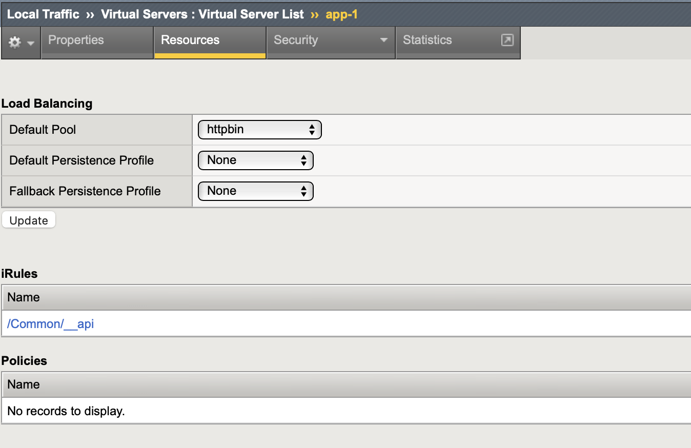

Broken Object Level Authorization (BOLA) Protection
====

Object term frequently used to represent a collection of data / profile (user name, address, phone, etc). 
This Object access must be restricted only for the user who own the data. User1 cannot access user2 profile.
Broken access control to this Object can leads to data breach.

Additional access control like must be implemented. 
Simple example: passanger name in the ID card should be same as printed in the train ticket.

Create User Name Session Variable On Session Creation
----

In this step, user name in the access token is extracted and saved to session variable.

Create an iRule to extract user name from ``session.oauth.scope.last.introspect.username`` and save it as session variable ``session.custom.uname``

.. code-block::
  :linenos:

  when ACCESS_POLICY_COMPLETED {
    set uname [lindex [split [ACCESS::session data get "session.oauth.scope.last.introspect.username"] "."] 1]
    log local0.notice "introspect.username=$uname"
    ACCESS::session data set session.custom.uname $uname
  }

Then attach the iRule to virtual server ``app-1``.

Add User Check Logic In Policy
----

Edit the ``app-1-prp`` created earlier in :ref:`rs prp`.

1. Add new process by click plus (+) sign after **allow** output of **Scope Check** process box, add **General Purpose > Empty** item

   .. image:: img/301-user-check-1.png

#. Set **User Check** as new process name

   .. image:: img/301-user-check-2.png

#. Open **Branch Rules** tab.
   Click **Add Branch Rule**, give it a name **"ok"**.

   .. image:: img/301-user-check-3.png
   
   Click **"change"** 

   .. image:: img/301-user-check-4.png

   Open **"Advanced"** tab to edit branch expression and put following expression::

      expr {[mcget {session.custom.uname}] equals [mcget {request.query.u}]}

   Here defined the logic to do user matching between HTTP request & access token

   .. image:: img/301-user-check-5.png
   .. image:: img/301-user-check-6.png
   
#. Change the flow **Endings**

   .. image:: img/301-user-check-7.png

#. This is the final policy flow

   .. image:: img/301-user-check-8.png

Testing The Configuration
----

#. Get new access token, login using admin user

   .. image:: img/302-test-ucheck-1.png

#. Try to access using admin user ``https://10.1.10.102/headers?u=admin``

   .. image:: img/302-test-ucheck-4.png

   The response is HTTP 200, with a lot of request parameters displayed back

#. Change the admin to operator user ``https://10.1.10.102/headers?u=operator``

   .. image:: img/302-test-ucheck-5.png

   The reponse is HTTP 403 Forbidden, because the access token was issued for ``admin`` user
