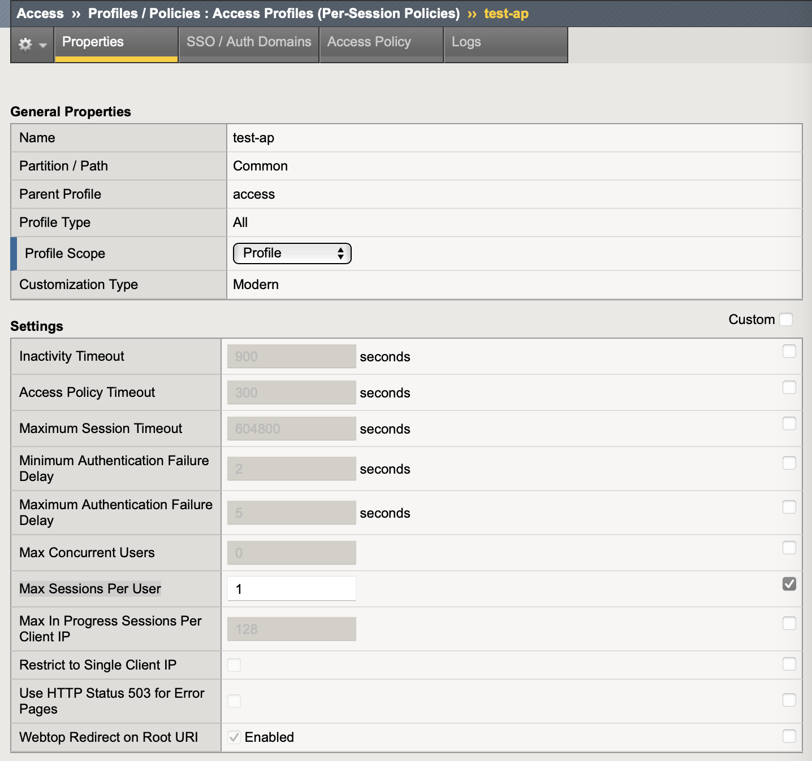
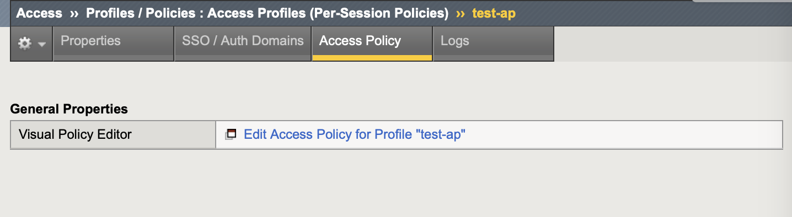
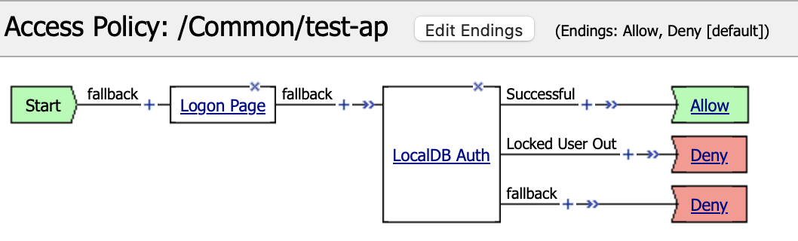
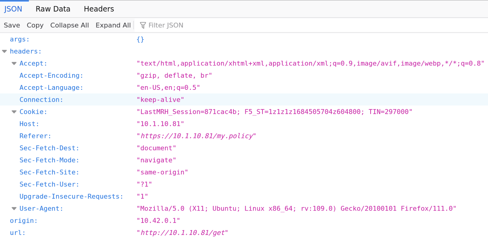
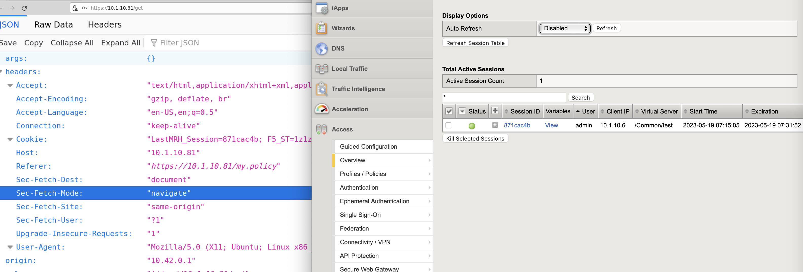
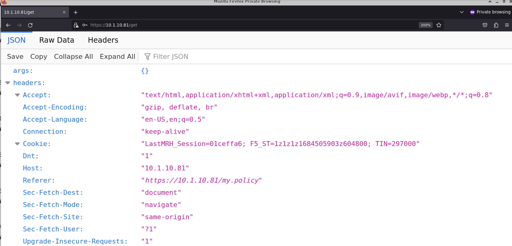
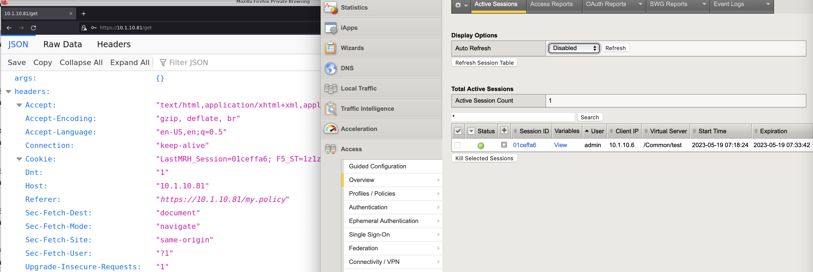

Limiting User Access Session
====

Create access policy to make sure only one user access session at a time.
Any other new session using the same user will terminate previous old session immediately and new login is required.

The test will be conducted using same client IP address 
but different browser (normal & private browsing)

Create Access Policy
----

Navigate to **Access  ››  Profiles / Policies : Access Profiles (Per-Session Policies)**

- Name: test-ap
- Profile Type: All
- Profile Scope: Profile
- Max Sessions Per User: 1
- OAuth Profile: None
- Languages: English (en)

Add Access Authentication
----

Edit the policy using Visual Policy Editor.

Create user authentication flow.

Testing
----

First access to https://10.1.10.81/get and the request will be redirected to login page.
Try login using credential: admin/admin

A new access session is created

Now in the same client open "Private Browsing" window and access the same URL above, request will be redirected to login page.
Try login using credential: admin/admin

A new access session is created and the old one is deleted

To confirm previous session deletion, go back to non-private browser window and do page refresh, the request should be redirected to login page.