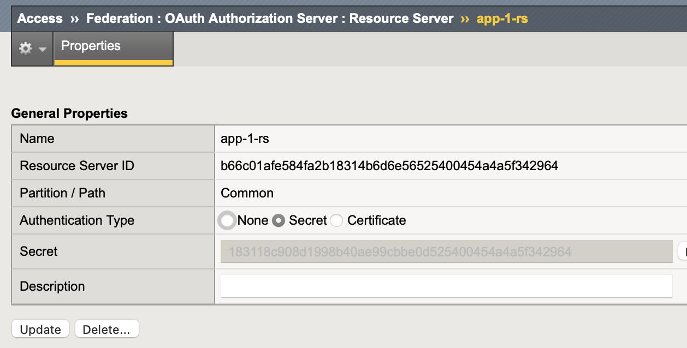
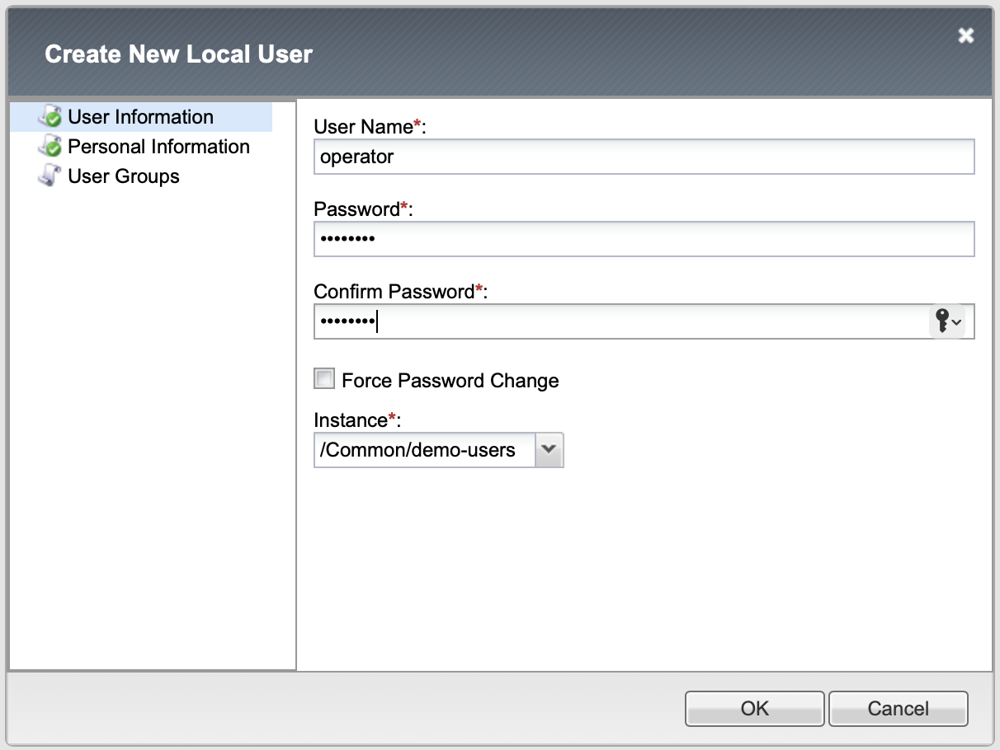
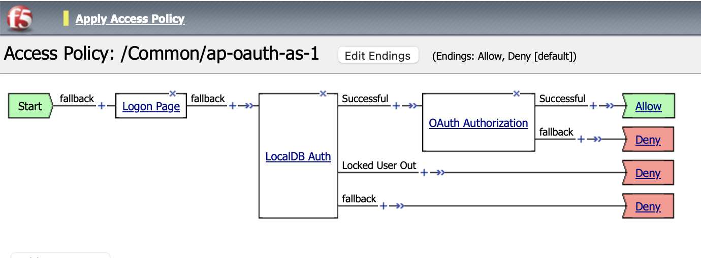

OAuth Opaque Token
====

Creating OAuth Scope 
----

Navigate to **Access  ››  Federation : OAuth Authorization Server : Scope**
   
Click **Create** button and fill in following parameters:
   
- Name: request
- Scope Name: request
- Caption: request

.. image:: img/11-new-scope.png
   
Click **Repeat** button, and create another scope below:
   
- request.headers
- request.ip
- request.user-agent
- image
- image.jpeg
- image.png
- image.svg
- image.webp

Add An OAuth Client 
----

Navigate to **Access  ››  Federation : OAuth Authorization Server : Client Application**
   
Click **Create** button and fill in following parameters:

- Name: partner-app-1
- Application Name: partner-app-1
- Caption: partner-app-1
- Grant Type: Authorization Code / Hybrid
- Redirect URI(s): https://callback
- Scopes: request; image
 
After creation, click to OAuth client name to see generated Client ID & Secret, save it to be used on later step.

Add Oauth Resource Server (RS)
----

Navigate to **Access  ››  Federation : OAuth Authorization Server : Resource Server**

Click **Create** button and fill in following parameters:

- Name: app-1-rs
- Authentication Type: Secret

After creation, click again to RS name to see resource server ID & Secret, save it to be used on later step.

Create OAuth Profile
----

Navigate to **Access  ››  Federation : OAuth Authorization Server : OAuth Profile**

 - Name: oauth-opaque
 - Client Application: Move ``partner-app-1`` from Available to Selected
 - Resource Server: Move ``app-1-rs`` from Available to Selected

 .. image:: img/14-oauth-profile-1.png

Create Local Identity Provider (IdP)
----

Navigate to **Access  ››  Authentication : Local User DB : Instances**

Click **Create New Instance** button to create new user database instance & fill in following parameters:

- Name: demo-users
- Lockout Interval (in seconds): 600
- Lockout Threshold: 3
- Dynamic User Remove Interval (in seconds): 1800

Add Sample User Credentials
----

Create admin & operator users from menu: **Access  ››  Authentication : Local User DB : Users**

Create Access Policy
----

Navigate to  **Access  ››  Profiles / Policies : Access Profiles (Per-Session Policies)**

- Name: ap-oauth-as-1
- Profile Type: All
- OAuth Profile: 
- Languages: English (en)

Create Access Policy Flow
----

Edit just created policy using Visual Policy Editor (VPE)

Add Logon > Logon Page

Add Authentication > LocalDB Auth

Add Authentication > OAuth Authorization

Change OAuth Authorization end to "Allow"

The policy flow view

Apply Access Policy & Close the VPE

Create Virtual Server
----

Create a virtual server to serve as OAuth Authorization Server service
    
- Name: oauth_as_vs
- Destination Address/Mask: 10.1.10.70
- Service Port: 443
- HTTP Profile (Client): http
- SSL: clientssl
- Access Profile: ap-oauth-as-1
    
Testing Opaque Token Request
----

Get bearer token test using Postman

Configure Postman as ``partner-app-1`` client then click the **Get New Access Token**

Verify user credential

Authorization confirmation

Opaque bearer token received from OAuth AS

This conclude the configuration of OAuth AS server to generate opaque token.