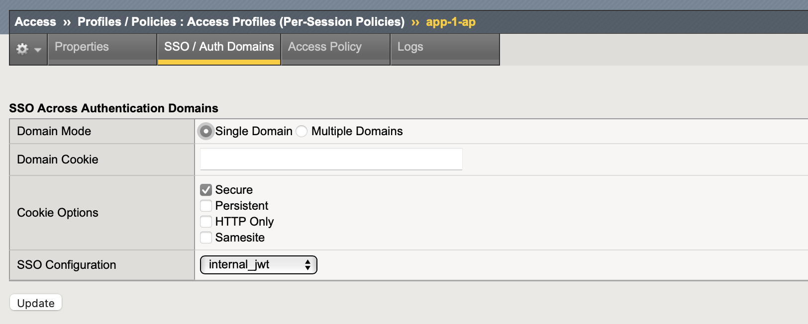

Implement Phantom Token (Token Conversion) Model
====

Create JWT Claim
----

Navigate to **Access  ››  Federation : OAuth Authorization Server : Claim**

Configure with following parameters:

- Name: username_internal
- Claim Type: string
- Claim Name: name
- Claim Value: ``%{session.oauth.scope.last.introspect.username}``

.. image:: img/301-jwt-claim-1.png

Create JWT Key
----

Navigate to **Access  ››  Federation : JSON Web Token : Key Configuration**

Configure new JWT key configuration with following parameters:

- Name: api-jwt
- ID: api-jwt
- Type: Octet
- Signing Algorithm: HS256
- Shared Secret: rahasia

.. image:: img/301-jwt-key-1.png

Create OAuth Bearer Profile
----

Navigate to **Access  ››  Single Sign-On : OAuth Bearer**

Click create and configure with following parameters:

- Name: internal_jwt
- Token Source: Generate JWT
- Issuer: ``https://percobaan``
- Subject: clear the value or leave default
- Signing Key: api-jwt
- Scope: ``%{session.oauth.scope.last.introspect.scope}``
- JWT Claims: Move ``username_internal`` from Available to Selected

.. image:: img/301-sso-1.png

Add SSO In Access Profile
----

Edit resource server access profile previously created in :ref:`rs access profile`.
Navigate to **Access  ››  Profiles / Policies : Access Profiles (Per-Session Policies)  ››  app-1-ap** then open the **SSO / Auth Domain** tab.

Change **SSO Configuration** to **internal_jwt**

Test The Configuration
----

Back to Postman GUI

1. Get new access token

   .. image:: img/301-test-1.png

#. New opaque access token is set as Authorization in request header. 
   Click **Send** to create the request.

   .. image:: img/301-test-2.png

#. The opaque token converted to JWT as reported in ``httpbin`` response.

   .. image:: img/301-test-3.png

#. Open JWT decoder from https://jwt.io then copy & paste JWT access token string.
   See the ``scope`` & ``name`` value.

   .. image:: img/301-test-4.png

This conclude phantom token lab guide.