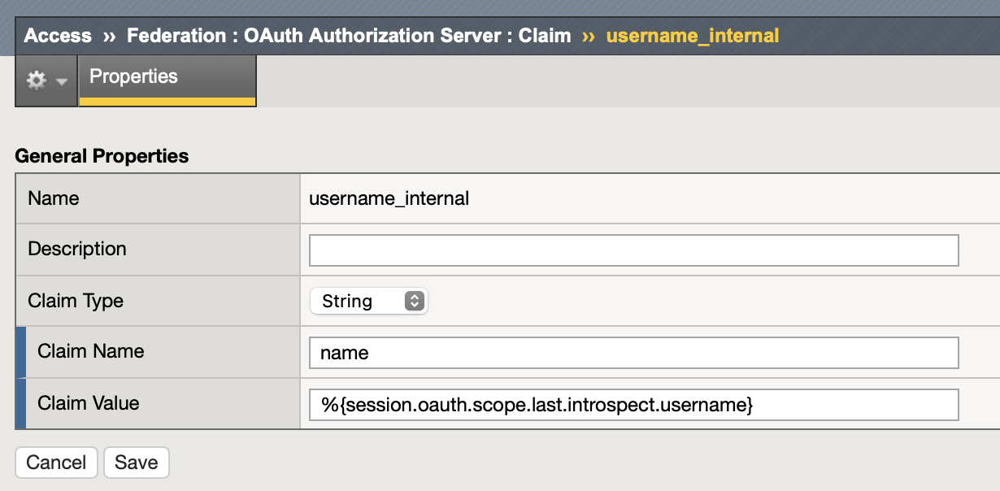
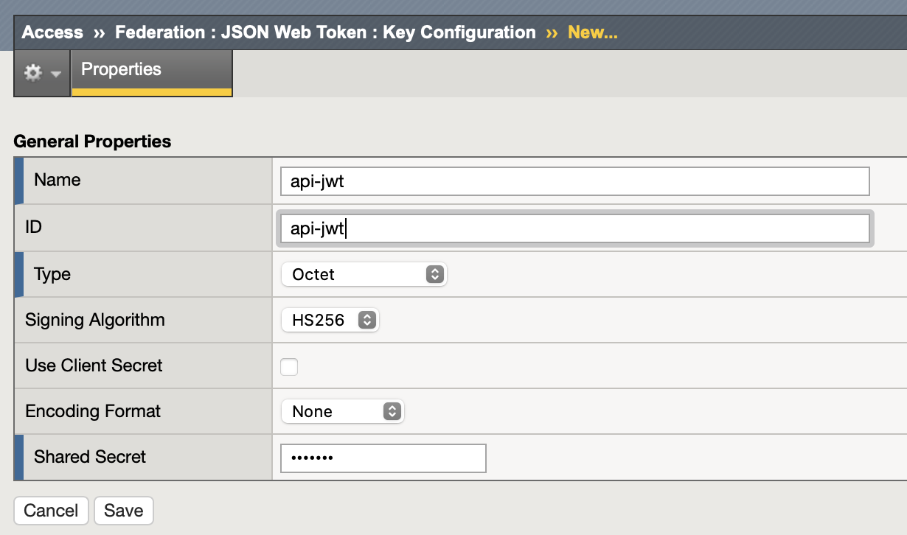
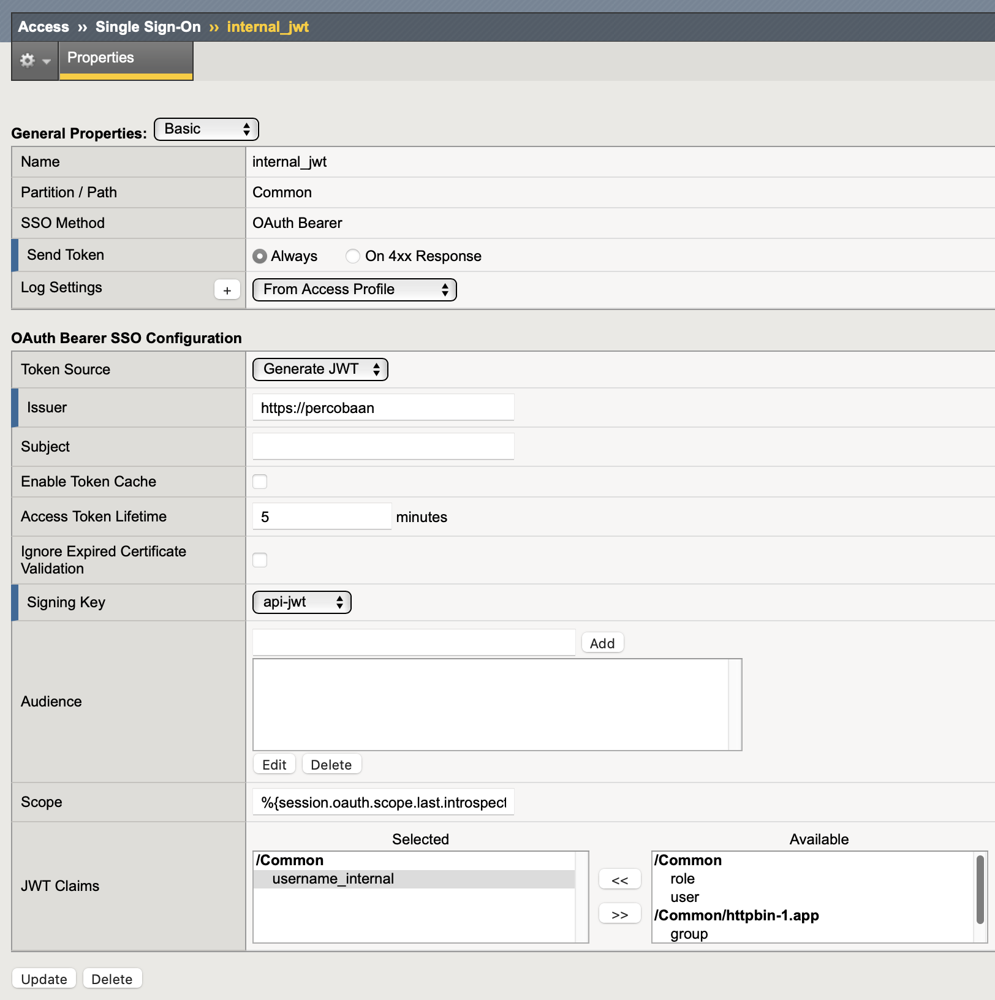

Convert Opaque Access Token To JWT
====

Create JWT Claim
----

Navigate menu to **Access  ››  Federation : OAuth Authorization Server : Claim**

Configure with following parameters:

- Name: username_internal
- Claim Type: string
- Claim Name: name
- Claim Value: ``%{session.oauth.scope.last.introspect.username}``

Create JWT Key
----

Navigate menu to **Access  ››  Federation : JSON Web Token : Key Configuration**

Configure new JWT key configuration with following parameters:

- Name: api-jwt
- ID: api-jwt
- Type: Octet
- Signing Algorithm: HS256
- Shared Secret: rahasia

Create OAuth Bearer Profile
----

Navigate menu to **Access  ››  Single Sign-On : OAuth Bearer**

Click create and configure with following parameters:

- Name
- Token Source: Generate JWT
- Issuer: ``https://percobaan``
- Subject: clear the value or leave default
- Signing Key: api-jwt
- Scope: ``%{session.oauth.scope.last.introspect.scope}``
- JWT Claims: Move ``username_internal`` from Available to Selected

